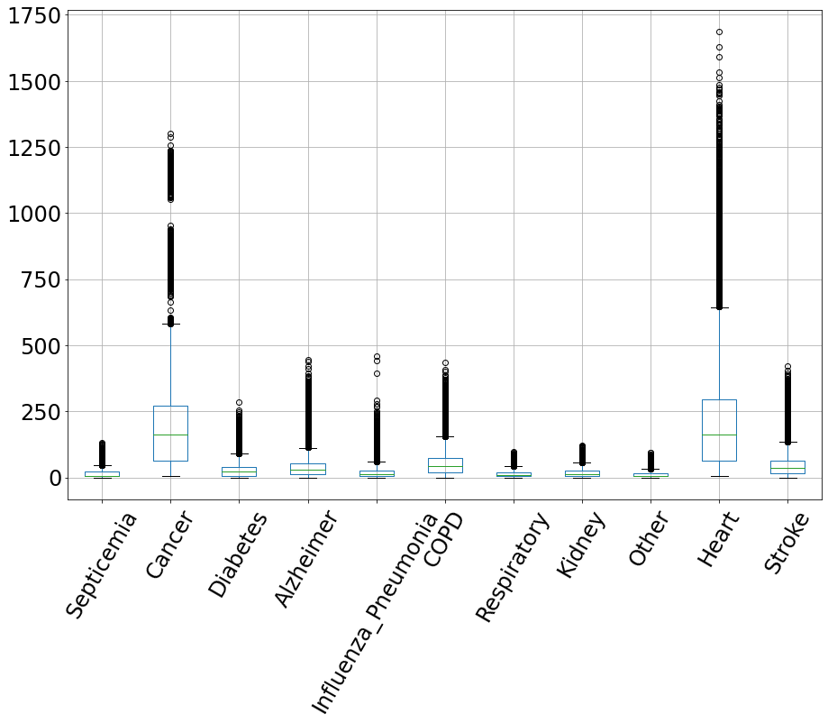

# Predicting Weekly Counts of Death from Influenza/Pneumonia  

## Data Collection, Organization, and Definitions  
I have used [Weekly Counts of Deaths by State and Select Causes, 2014-2018 published by the National Center for Health Statistics](https://data.cdc.gov/NCHS/Weekly-Counts-of-Deaths-by-State-and-Select-Causes/3yf8-kanr).
The dataset has data broken by State and it has several causes of deaths including:  Septicemia, Cancer, Diabetes, Alzheimer, Influenza/Pneumonia, Chronic lower respiratory diseases, Other diseases of respiratory system, Kidney, Heart, Stroke and Other symptoms. The total of 14, 094 records in 30 columns. 

## Exploratory Data Analysis  
If the weekly counts of deaths are between 0 and 9 it is suppressed to null and a null flag is raised in the matching column for the particular disease. I have replaced null values with 5 to simplify the calculations.  I have also removed the records giving the total count for all states.  
During this stage I have checked for some tendencies and found out that **cancer and heart disease are by far the two biggest killers** as can clearly be visible from the boxplot.

The plot below shows average numbers of deaths per week from all causes combined. It shows the cyclical nature of the death rate variation. The rates clearly decrease toward the middle of the summer and go up in the winter.  
  
  
Further investigation of the weekly death rates by various causes shows that each separate cause of death is cyclical as well. The two plots below show that. It is interesting to observe that while Diabetes has the least variation during the year, Heart Disease has the highest and other causes fall in between. The reason this has been split into two separate plots is to keep the same data range so the plots can be compared.  
  
  
  
## Pre-processing and Training Data Development  
Following steps have been taken for the data pre-processing:  
* Categorical State column has been replaced with the “dummy” quantifiable data.  
* Categorical and  “dummy” columns have been added for Seasons.  
* Additional column for the future week counts has been created by shifting the data by one week. This column will be used for training and validating the model.  

The data has been split into the training and testing data sets by using the later part of the data set from the year 2018 for test and earlier part of the data set from the years 2014-2017 data for training.

## Modeling  
Several models have been used with various feature selection. It appears that choosing between Linear Regression, Logistic Regression, Random Forest Classifier and SGDClassifier, Linear Regression produces the most accurate results. Linear Regression was the most accurate while using the most of the available features although adding squared or square root features didn’t improve the results. Running Linear Regression using Polynomial transformation didn’t improve the result either. 
Here is the summary of various models that I have tried:

| ----- | ------------------------------------ | --- | --- | --- | --- |
|       |                                      |  |  |  |  |
| Model | Features in additon to the base line |Standard Deviation Test |Standard Deviation Train | RMSE Test | RMSE Train |
| ----- | ------------------------------------ | --- | --- | --- | --- |
| LinearRegression | 'Influenza_Pneumonia', 'Respiratory', 'Nat_Cause', 'Septicemia', 'Cancer', 'Diabetes', 'Alzheimer', 'COPD', 'Kidney', 'Other', 'Heart', 'Stroke'" | 7.06 | 7.07 | 7.06 | 7.07 |
| LinearRegression| 'Influenza_Pneumonia', 'Respiratory'"|7.32|7.34|7.32|7.33 |
| LinearRegression| 'Influenza_Pneumonia'| 'Influenza_Pneumonia_SqRoot'| 'Respiratory' |7.48|7.24|7.48|7.24 |
| LinearRegression| 'Influenza_Pneumonia' |7.56|7.42|7.57|7.42 |
| LinearRegression| 'Influenza_Pneumonia', 'Influenza_Pneumonia_Squared', 'Respiratory' |8.60|7.23|8.61|7.23 |
| LinearRegression|Polinomial Features - too many to list|10.86|6.38|11.00|6.38 |
| RandomForestClassifier| 'Influenza_Pneumonia', 'Respiratory', 'Nat_Cause', 'Septicemia', 'Cancer', 'Diabetes', 'Alzheimer', 'COPD', 'Kidney', 'Other', 'Heart', 'Stroke' |11.01|4.56|11.32|4.71 |
| LogisticRegression| 'Influenza_Pneumonia', 'Respiratory', 'Nat_Cause', 'Septicemia', 'Cancer', 'Diabetes', 'Alzheimer', 'COPD', 'Kidney', 'Other', 'Heart', 'Stroke' |17.61|10.37|18.52|11.73 |
| SGDClassifier| 'Influenza_Pneumonia', 'Respiratory', 'Nat_Cause', 'Septicemia', 'Cancer', 'Diabetes', 'Alzheimer', 'COPD', 'Kidney', 'Other', 'Heart', 'Stroke'|21.55|18.20|22.71|19.19 |
| LinearRegression|Base Line|26.96|22.61|27.02|22.61 |
| ----- | ------------------------------------ | --- | --- | --- | --- |
